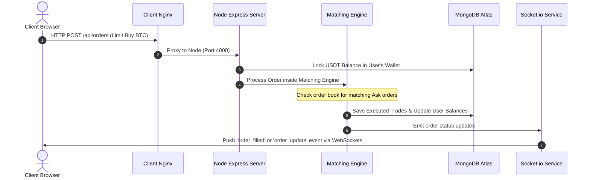

# CryptoVault Comprehensive System Documentation

Welcome to the comprehensive system documentation for **CryptoVault**, a high-fidelity cryptocurrency paper trading exchange simulator. This document aggregates all aspects of the platform: tech stack, directory layouts, operational flows, cloud architecture diagrams, step-by-step deployment instructions, and financial pricing models.

---

## 1. Technology Stack

### Client (Frontend)
* **Core Framework**: React 18 & Vite (for lightning-fast hot module replacement and production builds).
* **State Management**: Zustand (lightweight, hook-based global store for user authentication, orders, and market tickers).
* **Styling**: TailwindCSS (custom theme variables configured for dark-mode trading UI).
* **Charting**: Lightweight Charts (Financial charting library by TradingView for rendering OHLC candlestick graphs).
* **Icons**: Lucide React.
* **Real-time Sync**: Socket.io-client (handles real-time connections to the server for live order book and tick data updates).
* **API Requests**: Axios (configured with interceptors to automatically inject JWT authentication headers).

### Server (Backend)
* **Runtime & Framework**: Node.js & Express.
* **Database Mapping**: Mongoose (ODM mapping object structures to MongoDB Atlas).
* **WebSockets**: Socket.io (pushes real-time tick updates, order book changes, and execution updates).
* **Security & Auth**: `bcryptjs` (password hashing), JSON Web Tokens (`jsonwebtoken`), and `express-rate-limit` (DDoS prevention).
* **Order Engine Services**:
  - `MatchingEngine`: Decoupled order matching mechanism for processing limit and market order books.
  - `PriceEngine`: Periodically updates asset rates based on simulated volatilities.
  - `MarketMaker`: Simulates market liquidity by continuously placing bids/asks.

### DevOps & Hosting
* **Orchestration**: Docker & Docker Compose.
* **Web Server / Proxy**: Nginx (serves client files statically and proxies `/api` and `/socket.io` internally).
* **Cloud Platform**: AWS EC2 instance (`t3.medium`, Amazon Linux 2 / Ubuntu).
* **Managed Database**: MongoDB Atlas (external cloud database).

---

## 2. Directory Layout & File Structure

```text
CryptoVault/
├── DEPLOYMENT_COMMANDS.md     # Quick command checklist for deployments
├── PRICING_ANALYSIS.md        # Cost & financial analysis
├── PRICING_ANALYSIS.pdf       # Compiled PDF report
├── SYSTEM_DOCUMENTATION.md    # [This File] Main documentation blueprint
├── docker-compose.prod.yml    # Production compose stack (excludes local DB)
├── docker-compose.yml         # Local development compose stack (includes Mongo container)
├── client/
│   ├── Dockerfile             # Client image packaging (copies pre-built dist)
│   ├── nginx.conf             # Nginx reverse proxy configuration
│   ├── package.json           # Frontend dependencies & scripts
│   ├── vite.config.js         # Vite configuration (proxies /api in local dev)
│   ├── src/
│   │   ├── components/        # UI components (Trading panels, OrderBooks, Charts)
│   │   ├── hooks/             # Custom React hooks (tickers, candles, sockets)
│   │   ├── lib/               # Shared libraries (Axios instance, WebSocket connection)
│   │   ├── pages/             # Landing, log in, trade, dashboard, wallet, and admin pages
│   │   └── store/             # Zustand global stores (authStore, marketStore, orderStore)
└── server/
    ├── Dockerfile             # Node server image packaging
    ├── package.json           # Backend dependencies
    ├── server.js              # Application entry point (initializes Express & WebSockets)
    ├── config/                # Database connection and constant settings
    ├── middleware/            # JWT auth, roles, and error handlers
    ├── models/                # MongoDB Mongoose schemas (User, Order, Trade, Wallet, Transaction)
    ├── routes/                # Express API routes (auth, market, orders, wallet, admin)
    ├── services/              # Price feeds, matching engine, and socket services
    └── utils/                 # OHLC candlestick generators and mock seed script
```

---

## 3. Operational Data Flow & User Journeys

### A. Data Flow (Order Placement & Matching)


### B. User Journey Flow


---

## 4. Cloud Architecture Diagrams

Here are the visual architecture configurations deployed on your single AWS EC2 instance:

### A. High-Fidelity Diagram


### B. Low-Fidelity Diagram


---

## 5. Setup & Deployment Commands

Here is the exact checklist of commands used to deploy the platform on your EC2 instance (`54.197.10.99`):

### Phase 1: Local Machine Tasks
1. Set SSH permissions:
   ```bash
   chmod 400 cryptovault.pem
   ```
2. Build the Vite client project locally to offload compilation from the EC2 instance's RAM:
   ```bash
   cd client
   npm run build
   cd ..
   ```
3. Archive the project codebase:
   ```bash
   tar -czf archive.tar.gz --exclude="node_modules" --exclude=".git" --exclude="archive.tar.gz" -C . .
   ```
4. Transfer the archive to the EC2 server:
   ```bash
   scp -i cryptovault.pem archive.tar.gz ubuntu@54.197.10.99:/home/ubuntu/
   ```

### Phase 2: Remote Server Tasks (First-time Setup)
1. SSH into the instance:
   ```bash
   ssh -i cryptovault.pem ubuntu@54.197.10.99
   ```
2. Run clean install commands for Docker Engine:
   ```bash
   # Remove any broken docker package lists
   sudo rm -f /etc/apt/sources.list.d/docker.list

   # Run the official Docker installation script
   curl -fsSL https://get.docker.com -o get-docker.sh
   sudo sh get-docker.sh

   # Allow running docker commands without typing sudo
   sudo usermod -aG docker ubuntu
   rm -f get-docker.sh
   ```
   *Logout and log back in to apply group changes.*

### Phase 3: Application Run Tasks
1. Extract the uploaded tar archive:
   ```bash
   mkdir -p ~/CryptoVault
   tar -xzf ~/archive.tar.gz -C ~/CryptoVault
   rm ~/archive.tar.gz
   ```
2. Recreate and start the containers using the production file:
   ```bash
   cd ~/CryptoVault
   docker compose -f docker-compose.prod.yml up --build -d
   ```
3. Monitor status:
   ```bash
   docker ps
   docker logs -f cryptovault-prod-api
   ```

---

## 6. Pricing & Financial Analysis

### A. Business Model Canvas (BMC) Highlights
* **Value Proposition**: Risk-free simulation sandbox with real-time order book execution logic.
* **Customer Segments**: Newbie crypto traders, training centers, and financial developers.
* **Revenue Streams**:
  - Premium subscriptions at **₹499/month**.
  - B2B White-label licensing setup at **₹1,50,000** upfront + **₹25,000/month** maintenance.
  - Ad placements at **₹15,000/month**.

### B. AWS Infrastructure Costing (ap-south-1 Mumbai)
*Exchange rate: 1 USD = ₹83.50 INR*

* **EC2 Server Instance (`t3.medium`)**: $41.76 / month (**₹3,487**)
* **Amazon DocumentDB database (`db.t3.medium`)**: $57.60 / month (**₹4,810**)
* **Application Load Balancer**: $22.26 / month (**₹1,859**)
* **EBS Storage & Network Data Transfer**: $24.00 / month (**₹2,004**)
* **Security & System Backups**: $10.00 / month (**₹835**)
* **Total Monthly AWS Bill**: **$155.62** (**₹12,995**)
* **Total Yearly AWS Bill**: **$1,867.44** (**₹1,55,940**)

### C. Year 1 Projections
* **Total Operating Expenses (Hosting, Marketing, Retainers)**: **₹7,91,940 / year**
* **Total Projected Revenue (Subscriptions, B2B Licensees, Ads)**: **₹10,79,400 / year**
* **Net Profit**: **₹2,87,460 / year** (Operating at a **26.6%** profit margin)
