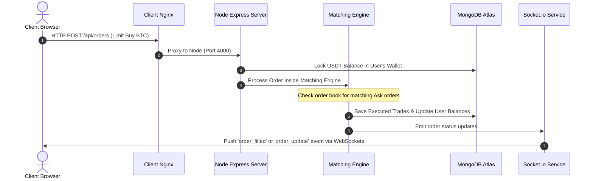
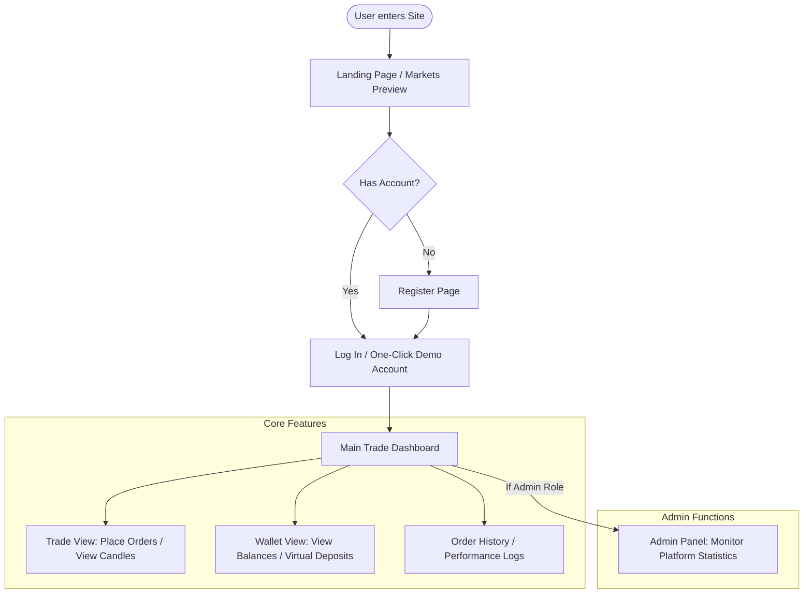

# CryptoVault: Core Architecture, Deployment Blueprint & Business Analysis

---

### 🎓 Academic Project Profile
| Field | Details |
| :--- | :--- |
| **Student Name** | **Sourabh Dinesh Yadav** |
| **Roll Number** | **150096724013** |
| **Cohort** | **MZ** |
| **Academic Batch** | **2024-28** |

---

## 1. Executive Summary & Project Scope

**CryptoVault** is a real-time, zero-risk cryptocurrency exchange simulator. It replicates the core features of a production trading platform (matching engines, live order books, price feeds, and custom wallets) for educational and strategy-testing purposes. Users are provisioned with simulated capital (**10,000 USDT**) to practice trading top crypto pairs (BTCUSDT, ETHUSDT, SOLUSDT, and others) without any financial risk.

---

## 2. Technology Stack & Component Specifications

The platform is designed using a decoupled Client-Server architecture separated by an Nginx reverse proxy.

```
                  ┌──────────────────────────────┐
                  │        Public Clients        │
                  │  (Browsers & Mobile Nodes)   │
                  └──────────────┬───────────────┘
                                 │ HTTP / WSS
                                 ▼ (Port 80)
                  ┌──────────────────────────────┐
                  │    Docker Nginx Container    │
                  │   (Static host + API Proxy)  │
                  └─────┬──────────────────┬─────┘
                        │                  │
           Static Files │                  │ Proxy /api & /socket.io
                        ▼                  ▼
                  ┌──────────┐       ┌──────────┐
                  │  Client  │       │  Server  │
                  │ (React)  │       │ (NodeJS) │
                  └──────────┘       └─────┬────┘
                                           │ Mongoose (SSL)
                                           ▼
                                     ┌──────────┐
                                     │ MongoDB  │
                                     │  Atlas   │
                                     └──────────┘
```

### A. Client Side (Frontend)
* **Core Engine**: React 18 with Vite compiler (bundling optimized ESModules in under 6 seconds).
* **State & Memory Store**: Zustand store modules:
  - `authStore`: Manages user credentials, JWT local storage caching, and socket connection cycles.
  - `marketStore`: Maintains real-time ticks, daily changes, and OHLC data streams.
  - `orderStore`: Handles user open orders, transaction logs, and history lists.
* **UI styling**: TailwindCSS utility framework with dark-theme values (`#0B0E11` deep background, `#F0B90B` exchange gold accent, `#0ECB81` buy green, and `#F6465D` sell red).
* **Interactive Charting**: Lightweight Charts library by TradingView, rendering multi-timeframe OHLC candles (`1m`, `5m`, `15m`, `1h`, `4h`, `1d`) dynamically.
* **Network layer**: Axios instance configured with custom request interceptors that inject the `Authorization: Bearer <JWT>` header from localStorage.

### B. Server Side (Backend)
* **API Framework**: Node.js & Express.
* **Real-time Gateway**: Socket.io (using WebSocket transport layer, supporting namespaces and room-joining).
* **Order Engine Components**:
  - `MatchingEngine`: A modular engine that processes order books. Bids and Asks are sorted and matched (Price/Time priority) upon placement.
  - `PriceEngine`: Generates simulated market ticks and historical candlestick updates based on customized volatility indices.
  - `MarketMaker`: Automatically places liquidity orders (bids/asks) into the order book to simulate real exchange trading volume.

---

## 3. Database Architecture & Schema Specifications

The database schema is mapped using Mongoose schemas connecting directly to MongoDB Atlas.

### Database Entities & Fields

```
 ┌─────────────────┐       ┌─────────────────┐       ┌─────────────────┐
 │      User       │       │     Wallet      │       │   Transaction   │
 ├─────────────────┤       ├─────────────────┤       ├─────────────────┤
 │ _id             │◄─────┐│ _id             │◄─────┐│ _id             │
 │ name            │      └│ userId          │      └│ userId          │
 │ email           │       │ balances: {     │       │ type (DEPOSIT)  │
 │ password        │       │   BTC: {        │       │ asset (USDT)    │
 │ role            │       │     free        │       │ amount          │
 │ createdAt       │       │     locked      │       │ reference       │
 └─────────────────┘       │   }             │       └─────────────────┘
                           │ }               │
 ┌─────────────────┐       └─────────────────┘       ┌─────────────────┐
 │      Order      │                                 │      Trade      │
 ├─────────────────┤                                 ├─────────────────┤
 │ _id             │◄───────────────────────────────┐│ _id             │
 │ userId          │                                └│ buyOrderId      │
 │ symbol          │◄───────────────────────────────┐│ sellOrderId     │
 │ side (BUY/SELL) │                                └│ price           │
 │ type (LIMIT)    │                                 │ quantity        │
 │ status          │                                 │ executedAt      │
 └─────────────────┘                                 └─────────────────┘
```

#### 1. User Schema (`User`)
Stores account access details and permission roles.
* `name` (String, Required): Full name of the user.
* `email` (String, Unique, Required): Email address.
* `password` (String, Required): Bcrypt-hashed password.
* `role` (String, Default: `'trader'`): Account access role (`'trader'` or `'admin'`).

#### 2. Wallet Schema (`Wallet`)
Maintains current account balances for each asset.
* `userId` (ObjectId, Ref: `'User'`, Unique): Owner relationship.
* `balances` (Map of Objects): Keyed by asset token symbol (USDT, BTC, ETH, BNB, etc.):
  - `free` (Number, Default: `0`): Spendable, tradeable asset balance.
  - `locked` (Number, Default: `0`): Balances currently locked in active open orders.

#### 3. Transaction Schema (`Transaction`)
Records virtual cash flows (deposits/withdrawals).
* `userId` (ObjectId, Ref: `'User'`): Target user.
* `type` (String): `'DEPOSIT'` or `'WITHDRAWAL'`.
* `asset` (String): Asset token symbol (e.g. `'USDT'`).
* `amount` (Number): Transaction volume.
* `balanceBefore` / `balanceAfter` (Number): Balance historical snapshots.

#### 4. Order Schema (`Order`)
Tracks trades placed on the platform.
* `userId` (ObjectId, Ref: `'User'`): Placer ID.
* `symbol` (String): Trading pair symbol (e.g. `'BTCUSDT'`).
* `side` (String): `'BUY'` or `'SELL'`.
* `type` (String): `'LIMIT'` or `'MARKET'`.
* `price` (Number): Requested unit price.
* `quantity` (Number): Order total size.
* `filledQty` (Number, Default: `0`): Amount filled so far.
* `status` (String): Current state (`'OPEN'`, `'PARTIALLY_FILLED'`, `'FILLED'`, `'CANCELLED'`).

#### 5. Trade Schema (`Trade`)
Records successful match executions between buy and sell orders.
* `buyOrderId` / `sellOrderId` (ObjectId, Ref: `'Order'`): Associated orders.
* `symbol` (String): Trading pair (e.g. `'BTCUSDT'`).
* `price` (Number): Executed transaction price.
* `quantity` (Number): Matched transaction volume.

---

## 4. WebSocket (Socket.io) Network Specifications

Real-time, bidirectional streams handle live updates. The client initiates WebSocket connections with the following event payloads:

### Inbound Events (Client to Server)
1. `'join_user_room'` (Payload: `userId`): Connects user to a private channel for receiving individual order fill notifications.
2. `'subscribe_ticker'` (Payload: `symbol`): Subscribes to 24h price change updates for a specific pair.
3. `'subscribe_candles'` (Payload: `{ symbol, interval }`): Subscribes to real-time candlestick feeds.
4. `'subscribe_orderbook'` (Payload: `symbol`): Subscribes to the live bid/ask order book.

### Outbound Events (Server to Client)
1. `'ticker'` (Payload: Ticker object): Live price ticks, 24h highs, lows, and percentage changes.
2. `'candle'` (Payload: Candle object): Real-time updates of the current open candlestick.
3. `'orderbook'` (Payload: Orderbook object): Depth updates (top 15 bids and asks).
4. `'order_filled'` (Payload: Trade event object): Notifies the user when an order has been successfully matched.

---

## 5. Flowcharts

### A. Data Flow (Order Placement & Matching)


### B. User Journey Flow


---

## 6. Cloud Architecture Diagrams

Below are the architectural diagrams deployed on your AWS EC2 instance:

### A. High-Fidelity Diagram


### B. Low-Fidelity Diagram


---

## 7. Security Hardening & Admin Protocol

### systemd Daemon Config
To ensure Docker and network services are started on host boot:
```bash
sudo systemctl enable docker.service
sudo systemctl enable containerd.service
```

### UFW firewall Rules
Only open SSH and HTTP/HTTPS ports to the public:
```bash
sudo ufw default deny incoming
sudo ufw default allow outgoing
sudo ufw allow 22/tcp comment 'Secure SSH'
sudo ufw allow 80/tcp comment 'HTTP Web traffic'
sudo ufw enable
```

### Fail2ban Brute-Force Shield (`/etc/fail2ban/jail.local`)
Prevents SSH brute-force scans:
```ini
[sshd]
enabled = true
port = 22
filter = sshd
logpath = /var/log/auth.log
maxretry = 5
bantime = 3600
```

---

## 8. Setup & Deployment Commands

### Phase 1: Local Machine Tasks (Vite compilation & SCP)
1. Apply correct SSH key permissions:
   ```bash
   chmod 400 cryptovault.pem
   ```
2. Build the client locally on your fast Mac:
   ```bash
   cd client
   npm run build
   cd ..
   ```
3. Compress files into a tar archive:
   ```bash
   tar -czf archive.tar.gz --exclude="node_modules" --exclude=".git" --exclude="archive.tar.gz" -C . .
   ```
4. Transfer the file to the EC2 server:
   ```bash
   scp -i cryptovault.pem archive.tar.gz ubuntu@54.197.10.99:/home/ubuntu/
   ```

### Phase 2: Remote Server Setup
1. SSH into the instance:
   ```bash
   ssh -i cryptovault.pem ubuntu@54.197.10.99
   ```
2. Run installation script for Docker Engine:
   ```bash
   # Remove any broken docker package lists
   sudo rm -f /etc/apt/sources.list.d/docker.list

   # Run the official Docker installation script
   curl -fsSL https://get.docker.com -o get-docker.sh
   sudo sh get-docker.sh

   # Allow running docker commands without typing sudo
   sudo usermod -aG docker ubuntu
   rm -f get-docker.sh
   ```
   *Logout and log back in to apply group changes.*

### Phase 3: Application Launch
1. Extract the uploaded tar archive:
   ```bash
   mkdir -p ~/CryptoVault
   tar -xzf ~/archive.tar.gz -C ~/CryptoVault
   rm ~/archive.tar.gz
   ```
2. Recreate and start the containers using the production file:
   ```bash
   cd ~/CryptoVault
   docker compose -f docker-compose.prod.yml up --build -d
   ```
3. Monitor status:
   ```bash
   docker ps
   docker logs -f cryptovault-prod-api
   ```

---

## 9. Pricing & Financial Analysis

### A. Business Model Canvas (BMC) Highlights
* **Value Proposition**: Risk-free simulation sandbox with real-time order book execution logic.
* **Customer Segments**: Newbie crypto traders, training centers, and financial developers.
* **Revenue Streams**:
  - Premium subscriptions at **₹499/month**.
  - B2B White-label licensing setup at **₹1,50,000** upfront + **₹25,000/month** maintenance.
  - Ad placements at **₹15,000/month**.

### B. AWS Infrastructure Costing (ap-south-1 Mumbai)
*Exchange rate: 1 USD = ₹83.50 INR*

* **EC2 Server Instance (`t3.medium`)**: $41.76 / month (**₹3,487**)
* **Amazon DocumentDB database (`db.t3.medium`)**: $57.60 / month (**₹4,810**)
* **Application Load Balancer**: $22.26 / month (**₹1,859**)
* **EBS Storage & Network Data Transfer**: $24.00 / month (**₹2,004**)
* **Security & System Backups**: $10.00 / month (**₹835**)
* **Total Monthly AWS Bill**: **$155.62** (**₹12,995**)
* **Total Yearly AWS Bill**: **$1,867.44** (**₹1,55,940**)

### C. Year 1 Projections
* **Total Operating Expenses (Hosting, Marketing, Retainers)**: **₹7,91,940 / year**
* **Total Projected Revenue (Subscriptions, B2B Licensees, Ads)**: **₹10,79,400 / year**
* **Net Profit**: **₹2,87,460 / year** (Operating at a **26.6%** profit margin)
